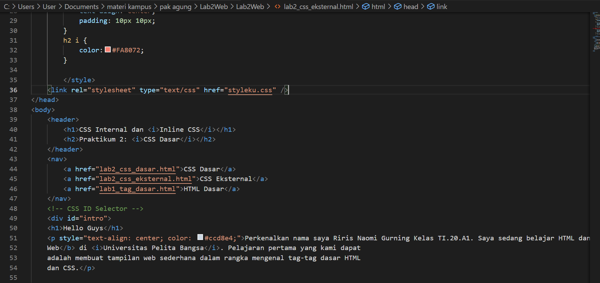

# Lab2Web

<strong>Repository ini dibuat untuk memenuhi tugas Pemrograman Web</strong>
| <strong>Nama</strong>      | <strong>Riris Naomi Gurning</strong>  |
| ----------- | ----------- |
| <strong>NIM</strong>     | <strong>312010190</strong>       |
| <strong>Kelas</strong>   | <strong>TI.20.A.1</strong>        |

# <strong>
<mark>LANGKAH - LANGKAH PRATIKUM 2 'CSS DASAR'</mark>
</strong>

# 1. <strong>Membuat dokumen HTML</strong>
   <strong>Buatlah dokumen HTML seperti berikut ini di VSCode:</strong>
    
   <strong>
Selanjutnya buka pada brwoser untuk melihat hasilnya.
</strong>
    

# 2. <strong>Mendeklarasikan CSS Internal></strong>
   <strong>Kemudian tambahkan deklarasi CSS internal seperti berikut pada bagian head dokumen.</strong>
    
   <strong>
Selanjutnya simpan perubahan yang ada, dan lakukan refresh pada browser untuk melihat
   hasilnya..
</strong>
    

# 3. <strong>Menambahkan Inline CSS</strong>
   <strong>Kemudian tambahkan deklarasi inline CSS pada tag '< p >' seperti berikut:</strong>
    
   <strong>
Simpan kembali dan refresh kembali browser untuk melihat perubahannya dan ini hasilnya: 
</strong>
    

# 4. <strong>Membuat CSS Eksternal</strong>
   <strong>Buatlah file baru dengan nama style_eksternal.css kemudian buatlah deklarasi CSS seperti berikut.</strong>
    
   <strong>
Kemudian tambahkan tag '< link >' untuk merujuk file css yang sudah dibuat pada bagian '< head >'
</strong>
    
    <strong>
Simpan kembali dan refresh kembali browser untuk melihat perubahannya dan ini hasilnya: 
</strong>
    

# 5. <strong>Menambahkan CSS Selector</strong>
   <strong>Selanjutnya menambahkan CSS Selector menggunakan ID dan Class Selector. Pada file
   style_eksternal.css, tambahkan kode berikut.</strong>
    
   <strong>
Simpan kembali dan refresh kembali browser untuk melihat perubahannya dan ini hasilnya: 
</strong>
    

# 6. <strong>Memembuat dokumen HTML dengan judul lab2_css_eksternal.html</strong>
   <strong>Buatlah dokumen HTML seperti berikut ini di VSCode :</strong>
    
    
   <strong>
Selanjutnya buka pada brwoser untuk melihat hasilnya.
</strong>
    

# Pertanyaan dan Tugas
1. Lakukan eksperimen dengan mengubah dan menambah properti dan nilai pada kode CSS
dengan mengacu pada CSS Cheat Sheet yang diberikan pada file terpisah dari modul ini.
2. Apa perbedaan pendeklarasian CSS elemen h1 {...} dengan #intro h1 {...}? berikan
penjelasannya!
3. Apabila ada deklarasi CSS secara internal, lalu ditambahkan CSS eksternal dan inline CSS pada
elemen yang sama. Deklarasi manakah yang akan ditampilkan pada browser? Berikan
penjelasan dan contohnya!
4. Pada sebuah elemen HTML terdapat ID dan Class, apabila masing-masing selector tersebut
terdapat deklarasi CSS, maka deklarasi manakah yang akan ditampilkan pada browser?
Berikan penjelasan dan contohnya! ( 
 )

# Jawaban 
1. Saya akan mengubah dan menambah properti dan nilai pada kode CSS, dimulai dari membuat kerangka html nya
   

   Kemudian membuat CSS nya dengan menambah properti dan nilai pada kode
   
   

   Hasilnya seperti dibawah ini:
   

   Selanjutnya saya menambahkan css id selector
   
   Hasilnya seperti ini:
   

